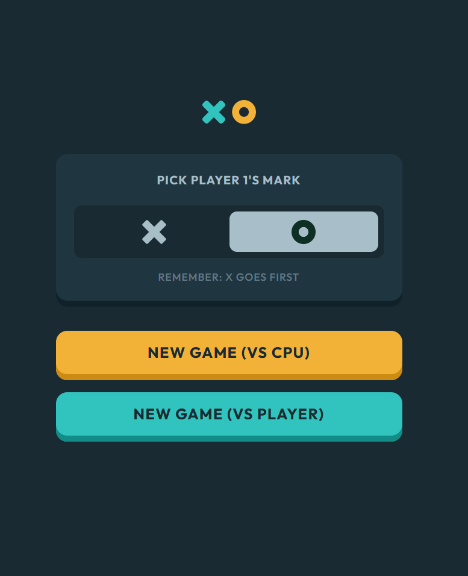

# Tic-Tac-Toe Game

This is a classic Tic-Tac-Toe game built using HTML, CSS, and JavaScript. The game allows two players to compete against each other or play against an AI with three difficulty levels. Enjoy the nostalgic gameplay and see who can achieve three in a row!

## Table of Contents

- [Introduction](#introduction)
- [Features](#features)
- [How to Play](#how-to-play)
- [Technologies Used](#technologies-used)
- [License](#license)
- [Acknowledgements](#acknowledgements)

## Introduction

Tic-Tac-Toe Game is a simple yet engaging web application that emulates the traditional Tic-Tac-Toe board game. It offers a player-versus-player mode where two players can take turns making moves on the 3x3 grid. Additionally, the game provides a single-player mode with three difficulty levels, including easy, medium, and hard, where players can challenge an AI opponent.

## Features

- **Player-Versus-Player Mode:** Challenge your friend and compete in real-time on the same device.
- **Single-Player Mode:** Test your skills against the AI with three difficulty levels (easy, medium, hard).
- **Interactive Gameplay:** Click on the available cells to make your moves and see the board update in real-time.
- **Win Detection:** The game automatically detects and announces the winner or a tie at the end of each round.
- **Points Tracking:** Keep track of each player's score during multiple rounds of gameplay.

## How to Play

1. Clone this repository to your local machine or download the source code as a ZIP file.
2. Open the `index.html` file in your web browser.
3. Choose your preferred mode: "2 Player" or "Single Player."
4. In "2 Player" mode, Player X starts, and players take turns clicking on an empty cell to make a move.
5. In "Single Player" mode, select the preferred difficulty level and start the game.
6. Click on an empty cell to make your move when it's your turn.
7. Try to get three of your symbols (X or O) in a row, either horizontally, vertically, or diagonally, to win.
8. The game will automatically detect and announce the winner or a tie at the end of each round.
9. To start a new game, click the "New Game" button on the summary board.
10. Enjoy the game and have fun!

## Technologies Used

- HTML: For creating the game's structure and user interface.
- CSS: For styling the game and implementing the dark and light themes.
- JavaScript: For handling game logic, user interactions, and AI gameplay.
- AI Algorithms: For providing single-player functionality with varying difficulty levels.

## License

This project is licensed under the [MIT License](LICENSE).

Feel free to customize, modify, or use this Tic-Tac-Toe Game as a template for your own projects. Happy gaming!

## Acknowledgements

- Frontend Mentor for providing the challenge and design.
- Sheneeza Volcov for coding the Tic-Tac-Toe Game.